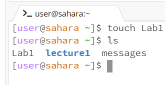
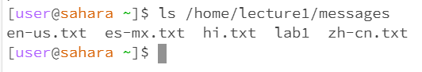
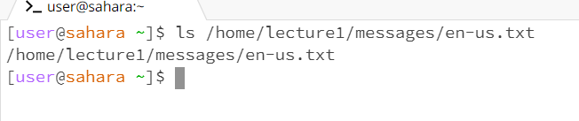
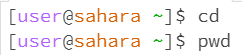
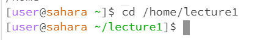
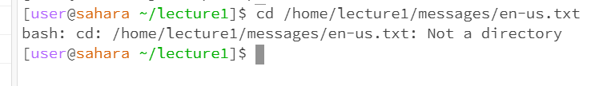
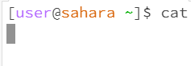
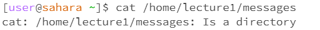

**ls**
1. ls no input 
   -the working directory was /home 
   -I got the output Lab1 lecture messages because those file are directly within the home 
   -there is no error 
    
3. ls with a path directory 
   -the working directory was /home/lecture1/messages 
   -I got the output of the text files because they were all directly within the messages folder 
   -there is no error 
    
5. ls with a path to a file 
   -the working directory was /home/lecture1/messages/en-us-txt 
   -I got the working directory as the output because ls can only display the files and folders in a given path 
   -there is no error 
    
**cd** 
1. cd no input 
   -the working directory is /home/lecture1/messages 
   -there was a change in the directory.. it went back to the home directory  
   -this is not an error since no directory was provided to change the directory 
    
3. cd with a path directory 
   -the working directory is now /home/lecture1 
   -there was a change seen in the left next to user lecture1 was added 
   -there is no error 
    
5. cd with a path to a file 
   -the working directory did not change still /home 
   -there was an error stating not a directory 
   -cd can only be used to change the folder we are in, so we cannot go into a file 
    
**cat** 
1. cat no input 
   -the working directory is /home 
   -there is no output 
   -this is not an error, cat prints the contents given. since nothing was given, nothing will be printed 
    
3. cat with a path directory 
   -the working directory is /home 
   -there is a message stating that a Is a directory 
   -since a directory to a folder is stated it is unable to print the contents because a file must be specified 
    
5. cat with a path to file 
   -the working directory is /home 
   -the output is Hello World! 
   -there is no error, the command prints the contents of the file specified 
   
